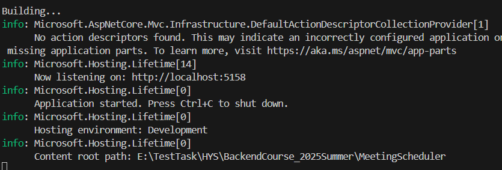
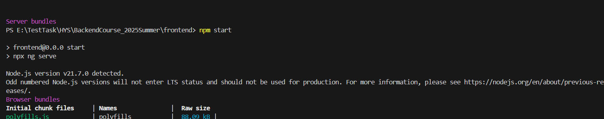
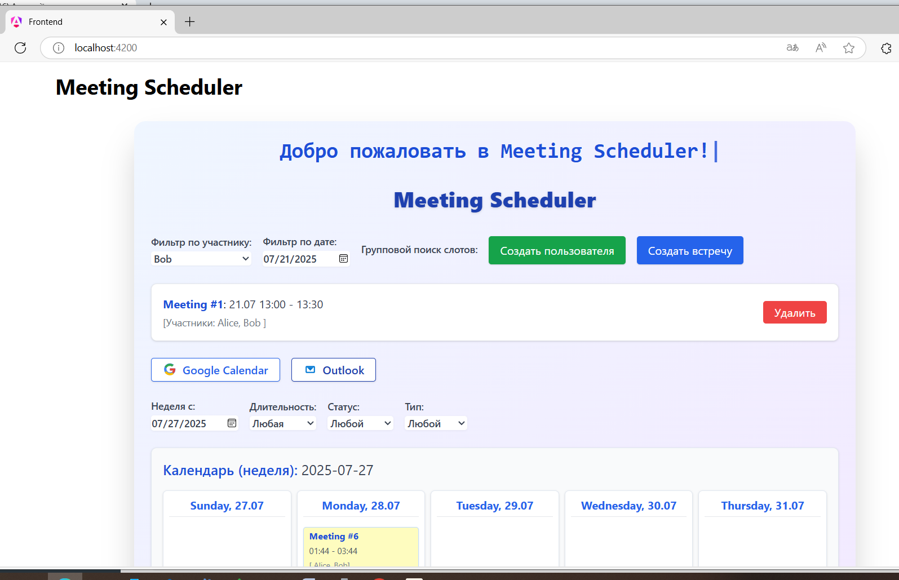
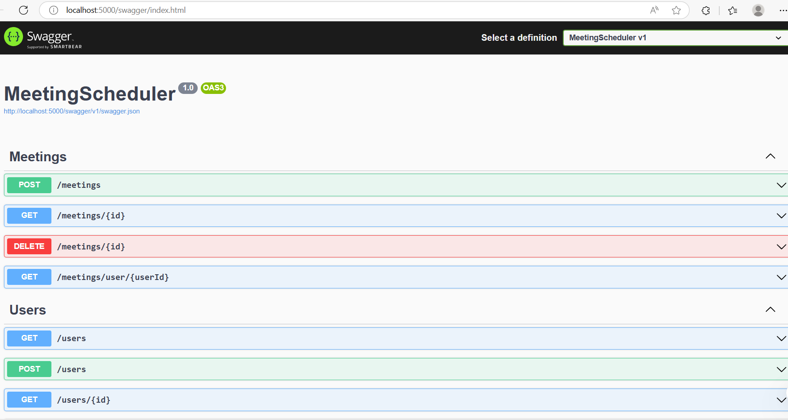
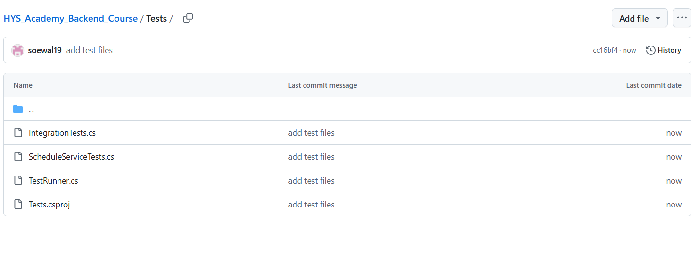

# Meeting Scheduler

## Tasks

Build a backend system to schedule meetings for multiple users without conflicts. You'll need to implement an algorithm that finds the earliest available time slot for a group of users given their existing schedules.

### Requirements

#### 1. Data Model:
- User: Id, Name
- Meeting: Id, Participants, StartTime, EndTime

#### 2. API Endpoints:
- POST /users
  - Body: { "name": "Alice" }
  - Creates a user
- POST /meetings
  - Body:
    {
      "participantIds": [1, 2, 3],
      "durationMinutes": 60,
      "earliestStart": "2025-06-20T09:00:00Z",
      "latestEnd": "2025-06-20T17:00:00Z"
    }
  - Returns the earliest time slot that fits all users' calendars
- GET /users/{userId}/meetings
  - Returns all meetings for a user

#### 3. Algorithm Challenge:
- Finds the earliest non-overlapping time slot that fits the duration and falls within the given day/time range
- Returns the proposed meeting time
- Edge cases: partial overlaps, back-to-back meetings, no available time slot

#### 4. Constraints:
- Business hours: 9:00–17:00 (UTC)
- In-memory data (no database required)
- ASP.NET Core

#### 5. Code Quality Expectations:
- Clean architecture encouraged
- Separation of concerns
- Unit-tested algorithm logic (mandatory)

### Testing

#### Unit Tests
- **ScheduleService Tests**: Full coverage of the scheduling algorithm, including:
  - Boundary conditions (minimum/maximum meeting duration)
  - Time slot validations
  - Conflict detection
  - Scheduling with multiple participants
  - Edge cases (no available slots, back-to-back meetings)

#### Integration Tests
- **API Endpoint Tests**:
  - User management (create, retrieve, delete)
  - Scheduling and retrieving meetings
  - Handling invalid data
  - Edge cases (non-existent users/meetings, empty participant lists)

#### Running Tests
```bash
# Run all tests
dotnet test

# Run a specific test project
dotnet test Tests/Tests.csproj

# Run with detailed output
dotnet test --logger:"console;verbosity=detailed"
```


### Time Estimates
- Core functionality: ~2–3 hours
- Testing and case coverage: additional 1–2 hours

### Submission
 - GitHub repository or archive
 - README with setup instructions and known limitations

### Program Output


## Backend




## Frontend




## Verstka




## Swagger




## Test




